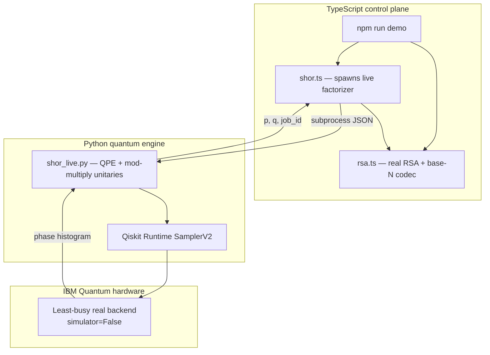
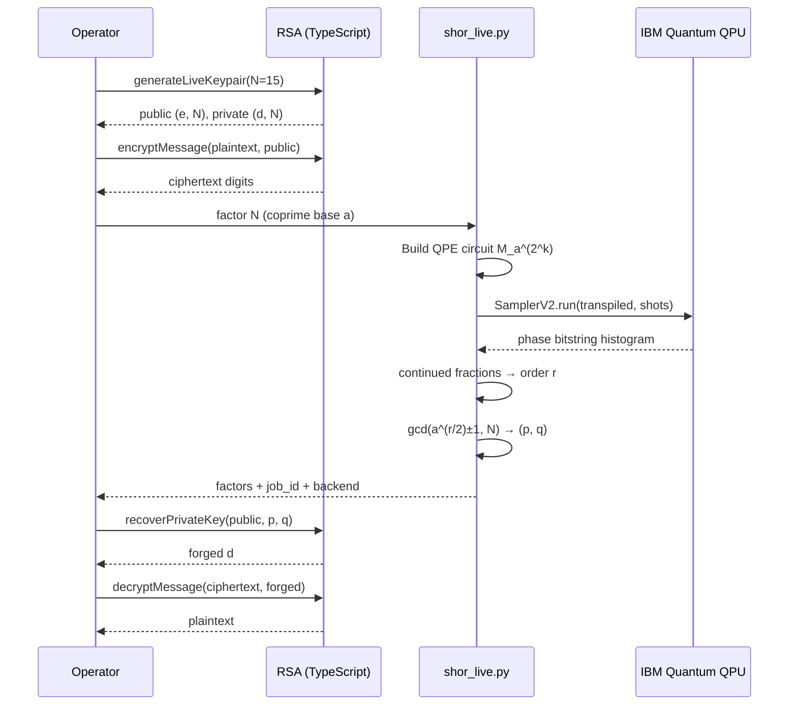
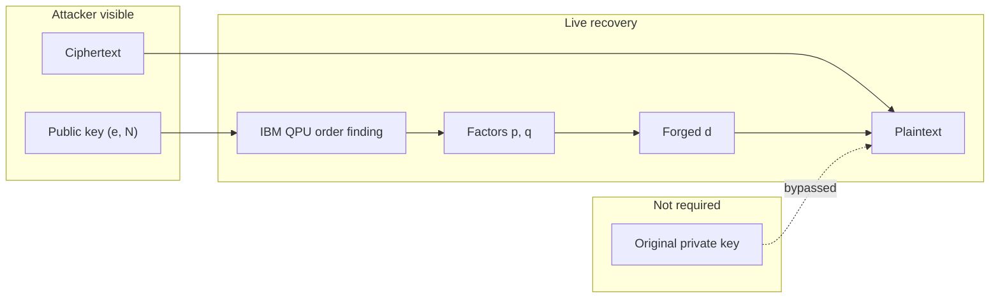

# ZOSMA Anti-Encryption

**Live cryptanalysis lab** — break real toy RSA by factoring `N` with **Shor’s algorithm on IBM Quantum hardware**.

No classical period-finding stand-in. No fake quantum stub. The order-finding circuit is built in Qiskit, transpiled to a physical backend, and executed with Runtime `SamplerV2`.

> Lab-scale only (`N ∈ {15, 21}`). Production RSA is out of reach of today’s QPUs — the algorithm and hardware path are real; the modulus is necessarily tiny.

[](https://nodejs.org/)
[](https://www.python.org/)
[](https://quantum.cloud.ibm.com/)
[](./LICENSE)

---

## Architecture



| Layer | Role |
| --- | --- |
| `src/rsa.ts` | Real RSA keygen / encrypt / decrypt / recover `d` |
| `src/shor.ts` | Invokes the live quantum engine |
| `quantum/shor_live.py` | Builds and runs the Shor order-finding circuit on a QPU |
| `src/index.ts` | End-to-end attack CLI |

---

## Live attack workflow



### Quantum order-finding circuit

```mermaid
flowchart LR
  H[Hadamards on phase register] --> CU[Controlled modular multiply<br/>a^(2^k) mod N]
  CU --> IQFT[Inverse QFT]
  IQFT --> M[Measure phase register]
  M --> CF[Continued fractions]
  CF --> R[Order r]
  R --> G[gcd factors]
```

For `N = 15`, modular multiplies use the compiled `SWAP` networks from IBM’s [Shor’s algorithm tutorial](https://quantum.cloud.ibm.com/docs/tutorials/shors-algorithm). Other live moduli use unitary modular-multiplication gates.

---

## Prerequisites

1. **Node.js 18+**
2. **Python 3.11+**
3. **IBM Quantum account** and API token from [quantum.cloud.ibm.com](https://quantum.cloud.ibm.com/)

```bash
# Node deps
npm install

# Quantum engine
pip install -r quantum/requirements.txt

# Live credentials (PowerShell)
$env:IBM_QUANTUM_TOKEN = "your_token_here"

# Live credentials (bash)
export IBM_QUANTUM_TOKEN=your_token_here
```

Optional:

| Variable | Purpose |
| --- | --- |
| `IBM_QUANTUM_CHANNEL` | Default `ibm_quantum_platform` |
| `IBM_QUANTUM_INSTANCE` | Runtime instance, if your account requires one |
| `PYTHON` | Python executable if not on `PATH` as `python` |

---

## High-asset encryption (hardest tiers)

Stacks that protect banks, governments, payments, and national systems — and how **taxonomy workflow flaws** void them without inverting AES-256:

```bash
npm run high-asset -- tiers
npm run high-asset -- audit --profile broken
npm run high-asset -- audit --profile hardened
npm run high-asset -- self-test
```

Docs: [docs/HIGH_ASSET_ENCRYPTION.md](./docs/HIGH_ASSET_ENCRYPTION.md), [docs/HIGH_ASSET_CODE_NARRATIVE.md](./docs/HIGH_ASSET_CODE_NARRATIVE.md).

Workable lab code uses **real AES-256-GCM**, proves nonce-reuse keystream leakage (`C1⊕C2 = P1⊕P2`), and enforces fail-closed tag verification.

---

## Encryption levels & taxonomy audits

ZOSMA catalogs **operational encryption levels** (classical → AEAD → PKI → post-quantum → tokens → quantum threat) and maps the **CODE_NARRATIVE_PROTOCOL flaw taxonomy** onto breaks of each level’s security workflow.

| Command | Purpose |
| --- | --- |
| `npm run audit -- levels` | List encryption levels |
| `npm run audit -- narratives` | Print narratives (promise + workflow) |
| `npm run audit -- audit --profile insecure` | Findings where controls are absent |
| `npm run audit -- audit --profile hardened` | Passes when controls are claimed |
| `npm run audit -- summary` | Old vs new posture |
| `npm run audit -- break sym.aead.gcm 4.6.2` | One break edge explained |

Docs: [docs/ENCRYPTION_NARRATIVES.md](./docs/ENCRYPTION_NARRATIVES.md), [docs/TAXONOMY_BREAKS_CRYPTO.md](./docs/TAXONOMY_BREAKS_CRYPTO.md).

The taxonomy breaks **implementation workflows** (nonce reuse, missing AEAD, JWT claims, IDOR on keys, secret logs). It does **not** magically invert AES. Live mathematical break in this repo remains **toy RSA via Shor**.

---

## Quickstart (live QPU)

```bash
git clone https://github.com/shep95/ZOSMA_ANTI_ENCRYPTION.git
cd ZOSMA_ANTI_ENCRYPTION
npm install
pip install -r quantum/requirements.txt
export IBM_QUANTUM_TOKEN=…   # required

npm run demo
```

This will:

1. Build an RSA keypair with `N = 15`
2. Encrypt `ZOSMA` with real modular exponentiation
3. Submit a Shor order-finding circuit to a **real** IBM backend
4. Recover `(p, q)` from the hardware histogram
5. Forge `d` and decrypt

Expect queue time on the public IBM Quantum fleet.

---

## Commands

| Command | What it does |
| --- | --- |
| `npm run demo` | Full live attack (`N=15`, message `ZOSMA`) |
| `npm start -- -n 21 -m "hi"` | Live attack with `N=21` |
| `npm run factor -- 15` | Factor `15` on hardware only |
| `npm run quantum:factor -- --n 15 --json` | Call the Python engine directly |
| `npm run build` | Compile TypeScript to `dist/` |

### CLI flags

| Flag | Description | Default |
| --- | --- | --- |
| `-n`, `--modulus` | `15` or `21` | `15` |
| `-m`, `--message` | Plaintext | `ZOSMA` |
| `--shots` | QPU shots | `1024` |
| `--backend` | Explicit IBM backend name | least-busy **real** QPU |
| `--max-attempts` | Max QPU base attempts | `2` |
| `--timeout-ms` | Wall-clock budget for the quantum engine | `1800000` |

---

## Threat model



| In scope | Out of scope |
| --- | --- |
| Real RSA for `N ∈ {15, 21}` | Production RSA / TLS |
| Real Shor QPE on IBM hardware | Classical order-finding shortcuts |
| Continued-fraction post-processing | Fault-tolerant cryptanalysis of large keys |

---

## Project layout

```text
ZOSMA_ANTI_ENCRYPTION/
├── NARRATIVE.md
├── src/
│   ├── index.ts          # End-to-end live attack
│   ├── factor.ts         # Factor-only CLI
│   ├── rsa.ts            # Real RSA
│   ├── shor.ts           # Quantum engine bridge
│   └── math.ts
├── quantum/
│   ├── shor_live.py      # Live Shor on IBM Quantum
│   └── requirements.txt
└── package.json
```

---

## References

- IBM Quantum — [Shor’s algorithm tutorial](https://quantum.cloud.ibm.com/docs/tutorials/shors-algorithm)
- Qiskit Runtime — [V2 primitives](https://quantum.cloud.ibm.com/docs/en/guides/v2-primitives)
- Story form of this lab — [NARRATIVE.md](./NARRATIVE.md)

## License & security

See [LICENSE](./LICENSE) and [SECURITY.md](./SECURITY.md).

For education and post-quantum awareness only. Do not attack systems you do not own or lack permission to test.
