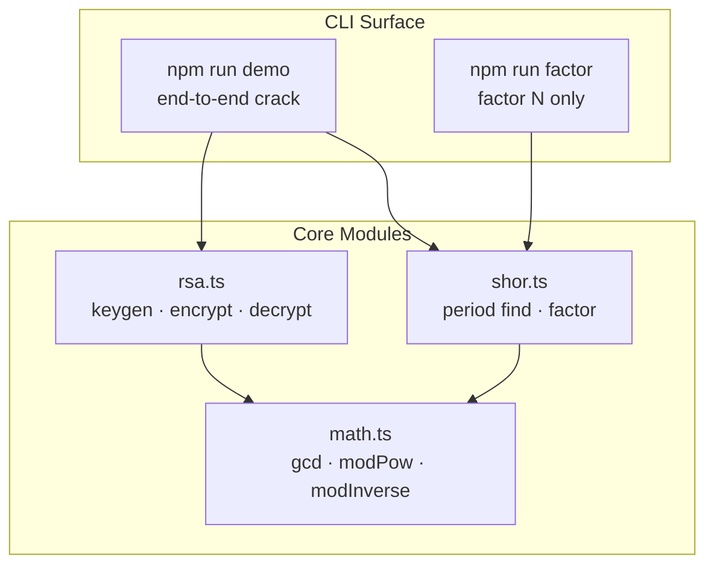
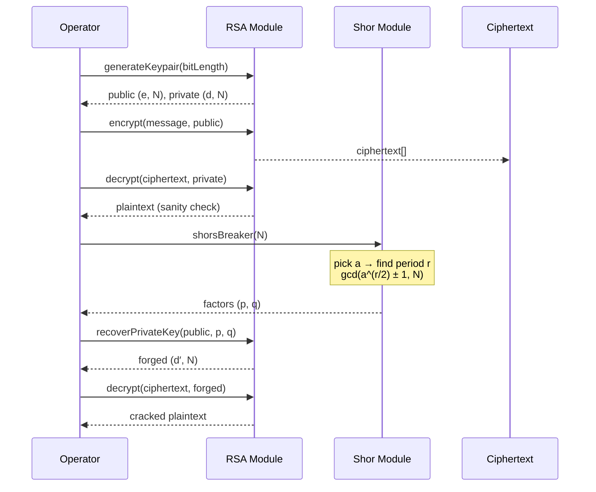
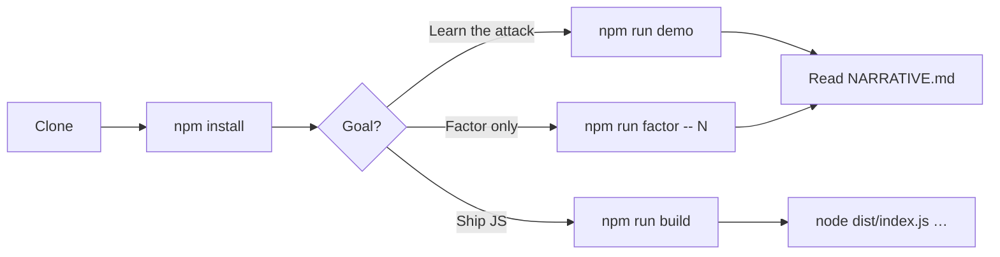
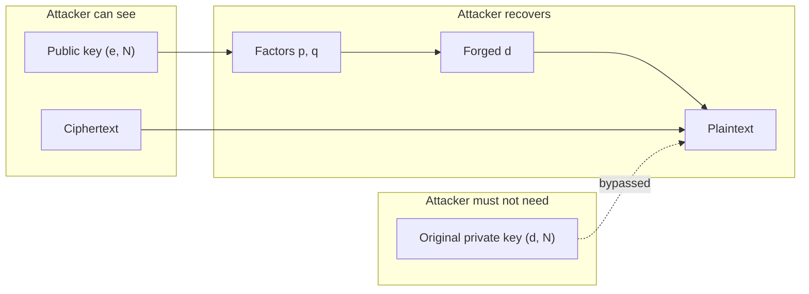

# ZOSMA Anti-Encryption

**Educational cryptanalysis lab** — break toy RSA by factoring the public modulus with Shor’s algorithm.

> Teaching demo only. Classical period finding on small moduli. Not a weapon against real-world RSA.

[](https://nodejs.org/)
[](https://www.typescriptlang.org/)
[](./LICENSE)
[](#quickstart)

---

## Why this exists

RSA’s public key exposes `N = p × q`. If you can factor `N`, you can rebuild the private exponent and read ciphertext that was never meant for you.

This repo turns that idea into a **runnable TypeScript workflow**: generate a toy lock, encrypt a message, factor `N` with Shor’s control flow, recover `d`, and decrypt — without the original private key.

Full story: [NARRATIVE.md](./NARRATIVE.md)

---

## Architecture



| Module | Responsibility |
| --- | --- |
| `src/rsa.ts` | Toy RSA keypair, encrypt, decrypt, recover `d` from factors |
| `src/shor.ts` | Shor factoring loop + classical period finding |
| `src/math.ts` | BigInt arithmetic primitives |
| `src/index.ts` | Full attack demo CLI |
| `src/factor.ts` | Standalone factorizer CLI |

---

## Attack workflow

End-to-end path implemented by `npm run demo`:



### Shor factoring loop

```mermaid
flowchart TD
  A([Start with N]) --> B[Pick random base a]
  B --> C{gcd(a, N) = 1?}
  C -->|No| D[Return factors from gcd]
  C -->|Yes| E[Find period r of a mod N]
  E --> F{r even and<br/>a^(r/2) ≢ −1 mod N?}
  F -->|No| B
  F -->|Yes| G["p = gcd(a^(r/2)+1, N)<br/>q = gcd(a^(r/2)−1, N)"]
  G --> H{Nontrivial factors?}
  H -->|No| B
  H -->|Yes| I([Return p, q])
  D --> I
```

On a large quantum computer, **period finding** is the quantum step. Here it runs **classically** so the lab works on any laptop — same control flow, educational moduli only.

---

## Quickstart

```bash
git clone https://github.com/shep95/ZOSMA_ANTI_ENCRYPTION.git
cd ZOSMA_ANTI_ENCRYPTION
npm install
npm run demo
```

Expected shape of output:

```text
=== Act 1: Build a small RSA lock ===
Primes p, q: …
Public key  (e, N): …

=== Act 2: Lock a message ===
Encrypted message: …
Decrypted with real private key: 7enTropy7

=== Act 3: Factor N with Shor's procedure ===
Factored N=… into (p, q)

=== Act 4: Forge private key and read the message ===
Message cracked using Shor's algorithm: 7enTropy7

Success: ciphertext recovered without the original private key.
```

---

## Commands

| Command | What it does |
| --- | --- |
| `npm run demo` | Full RSA generate → encrypt → factor → crack |
| `npm start -- -b 10 -m "secret"` | Custom bit length and message |
| `npm run factor -- 21` | Factor a single integer (e.g. `21 → 3 × 7`) |
| `npm run build` | Emit `dist/` via `tsc` |

### CLI options (`npm start`)

| Flag | Description | Default |
| --- | --- | --- |
| `-b`, `--bit-length` | Modulus size in bits (4–24) | `8` |
| `-m`, `--message` | Plaintext to encrypt and crack | `7enTropy7` |
| `-h`, `--help` | Show help | — |

---

## Developer workflow



```bash
# interactive-style run
npm start -- --bit-length 12 --message "hello"

# compile + run artifacts
npm run build
node dist/index.js --bit-length 8 --message "7enTropy7"
```

---

## Threat model (lab scope)



| In scope | Out of scope |
| --- | --- |
| Toy RSA (≈8–16 bit moduli) | Production RSA / TLS / real keys |
| Classical period finding | Real quantum hardware |
| Character-wise educational cipher | Padding, OAEP, hybrid encryption |

---

## Project layout

```text
ZOSMA_ANTI_ENCRYPTION/
├── NARRATIVE.md          # Story distilled from the original notebooks
├── src/
│   ├── index.ts          # End-to-end crack demo
│   ├── factor.ts         # Standalone factorizer
│   ├── rsa.ts            # Toy RSA
│   ├── shor.ts           # Shor factoring
│   └── math.ts           # BigInt helpers
├── Breaking_RSA.ipynb    # Original notebook (reference)
├── Factorizer_Quantum_Simulator.ipynb
└── RSA_module.py         # Original Python RSA (reference)
```

---

## Requirements

- **Node.js** 18+
- **npm** 9+

---

## License & security

See [LICENSE](./LICENSE) and [SECURITY.md](./SECURITY.md).

This repository is for **cryptography education and post-quantum awareness**. Do not use it against systems you do not own or lack permission to test.
